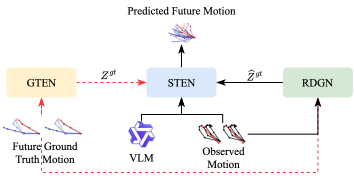

<h1 align="center">PromptFDDM V2: VLM-Prompted Future Diffusion for Hand Motion Prediction </h1>
<div align="center">

[Bowen Tang]()<sup>1</sup>&nbsp;
[Kaihao Zhang]()<sup>2†</sup>&nbsp;
[Wenhan Luo]()<sup>3</sup>&nbsp;
[Wei Liu]()<sup>4</sup>&nbsp;
[Min Zhang]()<sup>2</sup>&nbsp;
[Hongdong Li]()<sup>1</sup>&nbsp;

<sup>1</sup>Australian National University &nbsp;&nbsp;
<sup>2</sup>Harbin Institute of Technology (Shenzhen)&nbsp;&nbsp;
<sup>3</sup>HKUST&nbsp;&nbsp;
<sup>4</sup>Tencent Hunyuan<br>

<h4>
    <a href="">📄 Under review</a> &nbsp; 
</h4>

</div>

<div align="center">
    
</div>

<div style="width: 90%; height: auto; display: block; margin-left: auto; margin-right: auto;">
    The Spatial-Temporal Extraction Network (STEN) operates in two modes corresponding to the guidance it receives. During training, STEN is guided by historical visual context from a VLM and ground-truth future motion from the Ground Truth Extraction Network (GTEN). For inference, a Reference Data Generator Network (RDGN) generates plausible future guidance, conditioned on interactive prompts derived from the observed sequence. To mitigate the training-inference discrepancy, preference alignment bridges the gap between the guidance from GTEN and RDGN. The <span style="color: red;">red</span> dashed lines indicate the training-only pipeline. Black lines are used during both training and testing.

</div>
<br>

## Datasets

Our model is trained and evaluated on three public datasets:

-   **[FPHA (First-Person view)](https://github.com/guiggh/hand_pose_action)**  

-   **[HO3D (Third-Person view)](https://github.com/shreyashampali/ho3d)**  

-   **[H2O (First-Person view)](https://github.com/taeinkwon/h2odataset)**  

We adopt the data preprocessing pipeline from [GSPS](https://github.com/wei-mao-2019/gsps) to generate multi-modal data and valid angle data.
[Processed data and caption tensor](https://huggingface.co/BBuniverse/PromptFDDM-v2/tree/main)

```
dataset
├── FPHA_random.p
├── HO3D_v3_random.p
├── H2O_all_split_full.p
├── FPHA_valid_angle.p
├── HO3D_valid_angle.p
├── H2O_valid_angle.p
│
├── FPHA_multi_modal
│            ├── data_multimodal_t_his15_t_pred60_skiprate10_random.npz
│            └── t_his15_1_thre0.050_t_pred60_thre0.100_index_subAll_random.npz
├── HO3D_multi_modal
│            ├── data_multimodal_t_his20_t_pred80_skiprate15_random.npz
│            └── t_his20_1_thre0.050_t_pred80_thre0.100_index_subAll_random.npz
└── H2O_multi_modal
                ├── data_multimodal_t_his20_t_pred80_skiprate15_random_full.npz
                └── t_his20_1_thre0.050_t_pred80_thre0.100_index_subAll_random_full.npz

```

## Training

### 1. Installation

```bash
conda create -n hand python=3.9.20
conda activate hand
pip install numpy==1.26.4 torch==2.5.1 pynvml==12.0.0
pip install matplotlib scikit-image opencv-python natsort tqdm tensorboard ipdb transformers einops  swanlab
```

### 2. Train STEN with GTEN

This command trains the STEN model with GTEN guidance. You can select the dataset by changing the `config` and `device` number.

```bash
dataset=$1 # "FPHA"|"HO3D"|"H2O"
CUDA_VISIBLE_DEVICES=1 python STENTest.py --cfg ${dataset}_Caption_DPO --pretrain --gt --SE_block --Caption --seed
```

### 3. Train RDGN and Finetuning

This will load the weights of a pretrained GTEN model.

```bash
dataset=$1 # "FPHA"|"HO3D"|"H2O"
CUDA_VISIBLE_DEVICES=1 python STENTest.py --cfg ${dataset}_Caption_DPO --gt --pretrain --diffusion --promptFlag --SE_block --Caption --DPO --seed
```

### 4. Quick Inference

```bash
# metric
dataset=$1 # "FPHA"|"HO3D"|"H2O"
CUDA_VISIBLE_DEVICES=1 python STENTest.py --cfg ${dataset}_Caption_DPO --mode test --gt --diffusion --promptFlag --SE_block --Caption --DPO

# visualization
n_viz=10
CUDA_VISIBLE_DEVICES=1 python STENTest.py --cfg ${dataset}_Caption_DPO --mode viz --n_viz $n_viz --gt --diffusion --promptFlag --SE_block --Caption --DPO
```
-   `--n_viz`: Number of visualization samples to generate.
-   The generated GIFs will be saved in the corresponding experiment directory under `visualization/`.

## Visualization for hand motion prediction

### FPHA dataset

<div align="center" style="margin: 20px 0;">
  
  <br>
  <span style="color: #666; font-size: 1em;">
    GSPS
  </span>
</div>

<div align="center" style="margin: 20px 0;">
  
  <br>
  <span style="color: #666; font-size: 1em;">
    HumanMAC
  </span>
</div>

<div align="center" style="margin: 20px 0;">
  
  <br>
  <span style="color: #666; font-size: 1em;">
    PromptFDDMv2
  </span>
</div>

### HO3D dataset

<div align="center" style="margin: 20px 0;">
  
  <br>
  <span style="color: #666; font-size: 1em;">
    GSPS
  </span>
</div>

<div align="center" style="margin: 20px 0;">
  
  <br>
  <span style="color: #666; font-size: 1em;">
    HumanMAC
  </span>
</div>

<div align="center" style="margin: 20px 0;">
  
  <br>
  <span style="color: #666; font-size: 1em;">
    PromptFDDMv2
  </span>
</div>

### H2O dataset

<div align="center" style="margin: 20px 0;">
  
  <br>
  <span style="color: #666; font-size: 1em;">
    GSPS
  </span>
</div>

<div align="center" style="margin: 20px 0;">
  
  <br>
  <span style="color: #666; font-size: 1em;">
    HumanMAC
  </span>
</div>

<div align="center" style="margin: 20px 0;">
  
  <br>
  <span style="color: #666; font-size: 1em;">
    PromptFDDMv2
  </span>
</div>


